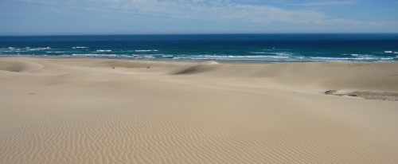

The International Sandy Beach Symposium is a triennial conference focused on the environmental, social and economic dimensions of sandy beach science, conservation, and management. First held in South Africa in 1983, the symposium returns to the Eastern Cape, with **ISBS10** being held at the **Cape St Francis Resort, 21-27 June 2027**. Navigate through the menu to find out more. 

{width="100%"}

## Partners and sponsors
