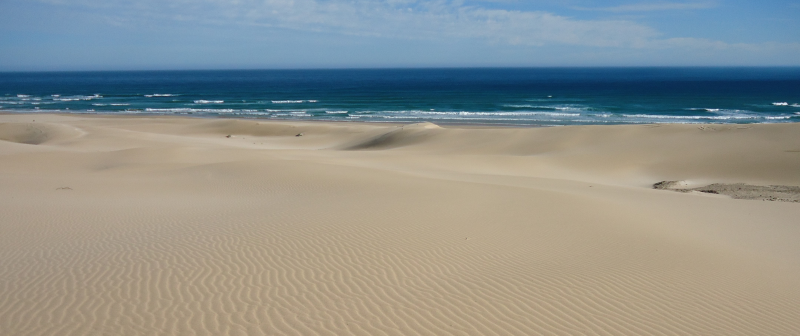
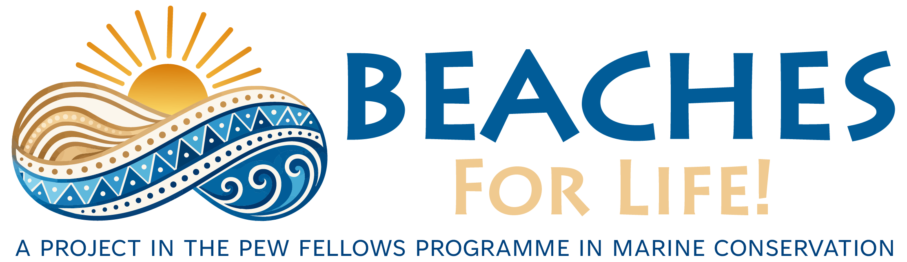
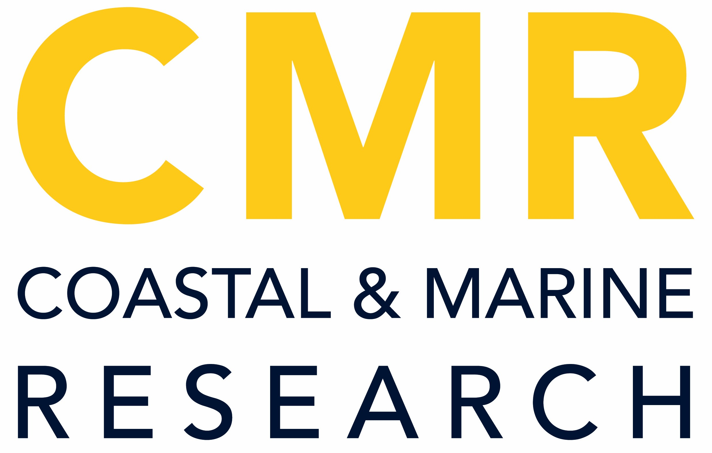
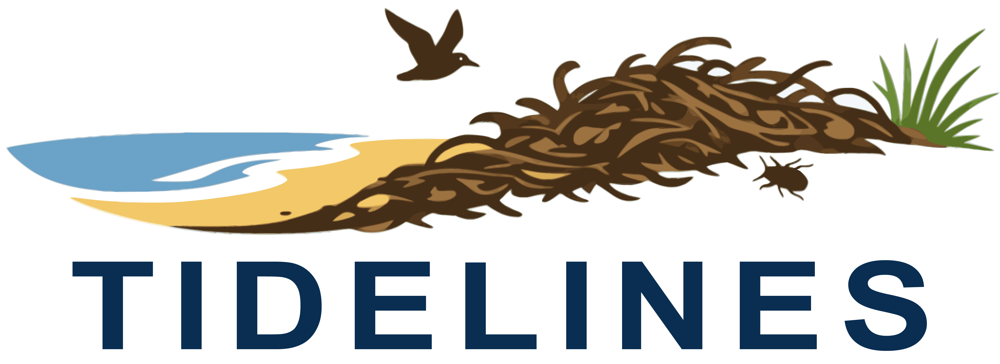

The International Sandy Beach Symposium is a triennial conference focused on the environmental, social and economic dimensions of sandy beach science, conservation, and management. First held in South Africa in 1983, the symposium returns to the Eastern Cape for ISBS10**.**

The **10th International Sandy Beach Symposium** will be held at the **Cape St Francis Resort, 21-27 June 2027**. See you there!

{width="100%"}

## Partners and sponsors

```{=html}
<div style="display:flex; flex-wrap:wrap; justify-content:center; align-items:center;">

  <div style="margin:0.5rem 1rem;">
    <a href="https://www.sandybeachscience.org" target="_blank">
      
    </a>
  </div>

  <div style="margin:0.5rem 1rem;">
    <a href="https://www.mandela.ac.za/" target="_blank">
      
    </a>
  </div>

  <div style="margin:0.5rem 1rem;">
    <a href="https://cmr.mandela.ac.za/" target="_blank">
      
    </a>
  </div>

</div>
```

```{=html}
<div style="display:flex; flex-wrap:wrap; justify-content:center; align-items:center;">

  <div style="margin:0.5rem 1rem;">
    <a href="https://www.biodiversa.eu/2026/04/03/tidelines/" target="_blank">
      
    </a>
  </div>

  <div style="margin:0.5rem 1rem;">
    <a href="https://www.biodiversa.eu/2026/04/03/tidelines/" target="_blank">
      
    </a>
  </div>

</div>
```

